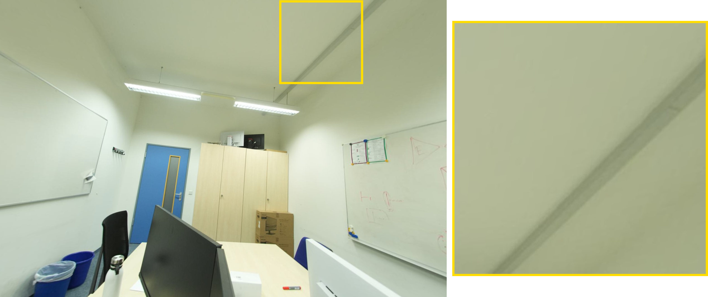
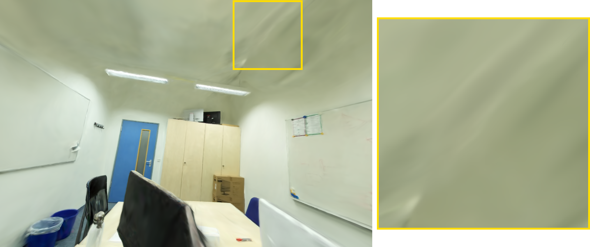
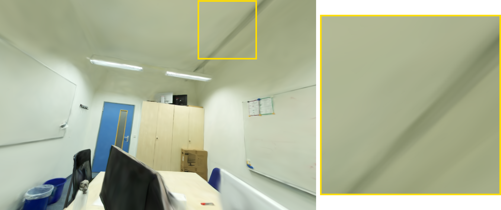
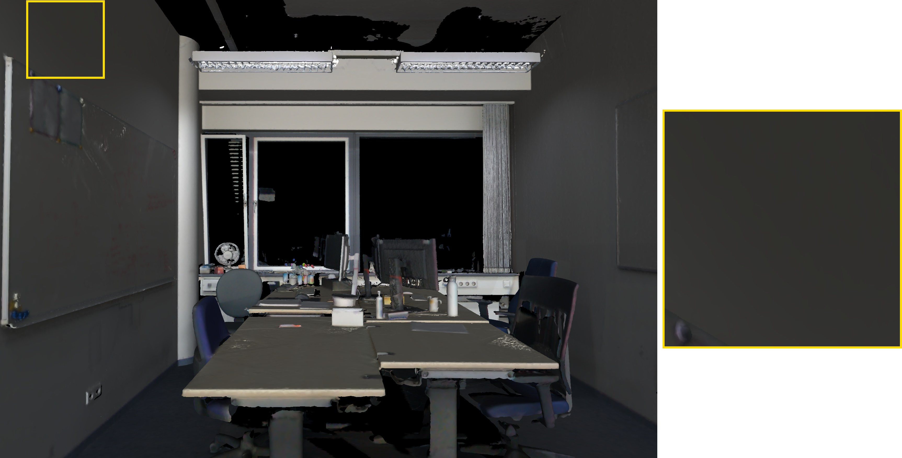
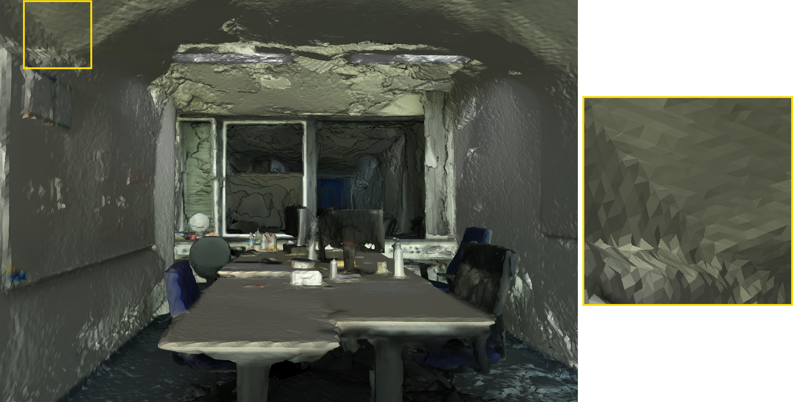
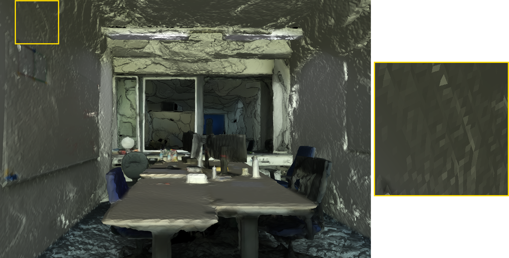

# **Improving 2DGS Using Technique from 3DGS Works**

This repository contains the implementation for the In-Course Project at the **Technical University of Munich (TUM)**, supervised by the 3D AI Lab. The project focuses on enhancing 2D Gaussian Splatting (2DGS)[^1] by integrating advanced densification strategies, geometric priors, and exposure optimization techniques originally discovered in 3DGS research.

## **🚀 Key Contributions**

* **MCMC Sampling:** Markov-Chain Monte Carlo sampling with adapted densification for superior Gaussian positioning and reduced artifacts.  
* **Depth Reinitialization:** Strategic re-initialization to mitigate overlapping Gaussians and under-reconstruction in sparse areas.  
* **Geometric Guidance:** Integration of depth and normal priors sourced from **DepthAnythingV2** and **DSINE**.  
* **Exposure Optimization:** A dedicated module for improving reconstruction performance on scenes with dynamic or inconsistent exposure (e.g., handheld iPhone captures).

## **📂 Repository Structure**

The project utilizes submodules for the core engine and dataset handling:

* 2DGScode/: Core 2D Gaussian Splatting implementation (Submodule).  
* scannetpp/: Utilities for the ScanNet++ dataset (Submodule).  
* scannetppdatacode/: Data downloading and preprocessing scripts.  
* batch_processing.py: The primary entry point for running combined modifications experiments.

## **⚙️ Setup and Installation**

### **1\. Clone the Repository**

```bash

git clone --recursive git@github.com:mahdikoubaa1/Improved_2D_Gaussian_Splatting.git
cd Improved_2D_Gaussian_Splatting

```
### **2\. Environment Setup**

The environment specifications are provided in environment.yml. Create the conda environment using:

```bash

conda env create -f environment.yml  
conda activate 2dgs_improved
```

## **🧪 Running Experiments**

Experiments are managed via batch\_processing.py.

\[\!IMPORTANT\]

To control which specific enhancements (MCMC, Priors, etc.) are active, you must edit the configuration flags within batch\_processing.py before execution.

### **Execution Commands**

**For DTU Scans:**

``` bash

python batch_processing.py --dataset_path <DTU_DIR> --output_path <OUT_DIR> --scene <SCAN_NAME> --subscene dtu
```
**For ScanNet++ iPhone Scenes:**

``` bash

python batch_processing.py --dataset_path <SCANNETPP_DIR> --output_path <OUT_DIR> --scene <SCAN_NAME> --subscene iphone
```
**For ScanNet++ DSLR Scenes:**

``` bash

python batch_processing.py --dataset_path <SCANNETPP_DIR> --output_path <OUT_DIR> --scene <SCAN_NAME> --subscene dslr
```
## **📊 Experimental Results**

We evaluated our improvements across three major benchmarks: **ScanNet++ (DSLR & iPhone)** and **DTU**.

### **Index Key**

To simplify the ablation tables, we use the following numbering:

1. **MCMC Sampling** (Adapted Densification)  
2. **Depth Reinitialization**  
3. **Geometric Guidance** (DepthAnythingV2 & DSINE Priors)

### **1\. ScanNet++ DSLR (Average over 3 Scenes)**

The combination of MCMC and Geometric Priors (1+3) yielded the best overall reconstruction quality.

| Model | PSNR ↑ | SSIM ↑ | LPIPS ↓ | AbsRel ↓ | Points |
| :---- | :---- | :---- | :---- | :---- | :---- |
| **Base Model** | 25.913 | 0.911 | 0.231 | 0.074 | 476,862 |
| **1+3 (MCMC \+ Priors)** | **26.335** | **0.917** | **0.220** | **0.054** | 476,862 |
| **1+2+3 (All)** | 26.159 | 0.916 | 0.225 | 0.066 | 476,862 |

### **2\. ScanNet++ iPhone (Average over 3 Scenes)**

Dynamic exposure scenes showed significant gains when applying our Exposure Optimization module.

| Model | PSNR ↑ | SSIM ↑ | LPIPS ↓ | CD ↓ | AbsRel ↓ |
| :---- | :---- | :---- | :---- | :---- | :---- |
| **Base Model** | 14.768 | 0.763 | 0.489 | 0.481 | 0.264 |
| **Exposure Opt.** | **15.779** | **0.783** | **0.460** | **0.418** | **0.219** |

### **3\. DTU Dataset (Average over 4 Scenes)**

MCMC sampling significantly boosts PSNR on the DTU objects, while geometric guidance helps refine the structural metrics.

| Model | PSNR ↑ | SSIM ↑ | LPIPS ↓ | CD ↓ | AbsRel ↓ |
| :---- | :---- | :---- | :---- | :---- | :---- |
| **Base Model** | 27.664 | 0.912 | 0.165 | 0.476 | 0.011 |
| **1+3 (MCMC \+ Priors)** | 29.492 | **0.922** | **0.137** | 0.587 | 0.012 |
| **1+2+3 (All)** | **29.989** | 0.909 | 0.183 | 0.661 | 0.013 |

### **Qualitative Results for NVS on Scannet++ Scenes (DSLR)**
<table style="width:100%; border-collapse:collapse; border:none;">
  <tr>
    <td align="center" style="width:33%; border:none;">
      <br>
      <b>Ground Truth</b>
    </td>
    <td align="center" style="width:33%; border:none;">
      <br>
      <b>Base 2DGS</b>
    </td>
    <td align="center" style="width:33%; border:none;">
      <br>
      <b>Ours (MCMC + Priors)</b>
    </td>
  </tr>
</table>

### **Qualitative Results for Mesh Reconstruction on Scannet++ Scenes (DSLR)**
<table style="width:100%; border-collapse:collapse; border:none;">
  <tr>
    <td align="center" style="width:33%; border:none;">
      <br>
      <b>Ground Truth</b>
    </td>
    <td align="center" style="width:33%; border:none;">
      <br>
      <b>Base 2DGS</b>
    </td>
    <td align="center" style="width:33%; border:none;">
      <br>
      <b>Ours (MCMC + Priors)</b>
    </td>
  </tr>
</table>

### **Key Takeaways**

* **MCMC \+ Priors (1+3):** This configuration is the most robust, providing the highest visual fidelity (PSNR/SSIM) and the best depth accuracy (AbsRel).  
* **Exposure Optimization:** Vital for handheld "unconstrained" captures (iPhone), yielding a massive **\+1.0 dB PSNR** gain.  
* **Point Cloud Efficiency:** Our methods maintain high performance without significantly inflating the point count, keeping the Gaussian primitives manageable.

## **🎓 Acknowledgments**

This project was completed as part of an In-Course Project at **TUM** (Dec 2025 \- Feb 2026).

* **Supervisor:** Prof. Dr. A. Dai  
* **Advisors:** M.Sc. Y. Liu, M.Sc. D. Gao, M.Sc. M. Boudjoghra

[^1]: Chen et al., "2D Gaussian Splatting for Geometrically Accurate Radiance Fields," SIGGRAPH 2024.
